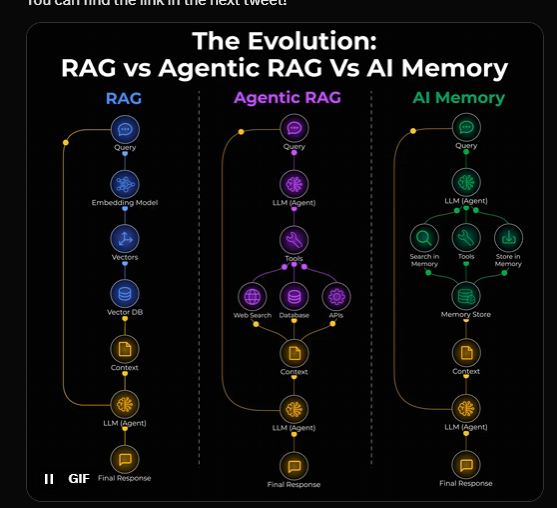

# Visual Comparison: RAG vs Agentic RAG vs AI Memory

This document provides a detailed explanation of the visual infographic that illustrates the evolution of AI memory systems.



## Overview

The infographic presents three parallel workflows that demonstrate the progression from simple retrieval to intelligent, adaptive memory systems. Each column represents a distinct approach, with nodes flowing from top to bottom to show the processing pipeline.

---

## Column 1: RAG (Retrieval-Augmented Generation)

**Color Theme**: Blue

**Tagline**: Read-only, one-shot retrieval

### Workflow Steps

1. **Query** 💬
   - The user's input question or request
   - Entry point for the RAG pipeline
   - Example: "What is machine learning?"

2. **Embedding Model** 🔷
   - Converts the query text into a vector representation
   - Uses models like OpenAI's `text-embedding-3-small` or `text-embedding-ada-002`
   - Output: A high-dimensional vector (e.g., 1536 dimensions)

3. **Vectors** 📊
   - The numerical representation of the query
   - Enables semantic similarity comparison
   - Format: Array of floating-point numbers

4. **Vector DB** 🗄️
   - Database optimized for vector similarity search
   - Examples: Pinecone, Weaviate, Qdrant, Chroma
   - Stores document embeddings for fast retrieval

5. **Context** 📄
   - Retrieved documents most similar to the query
   - Typically 3-5 chunks of relevant text
   - Ranked by cosine similarity or other distance metrics

6. **LLM (Agent)** 🤖
   - Large Language Model that generates the response
   - Receives both the query and retrieved context
   - Examples: GPT-4, Claude, Gemini

7. **Final Response** 💬
   - The generated answer based on retrieved context
   - Combines model knowledge with external information
   - Delivered to the user

### Characteristics

- **Read-Only**: Cannot modify the knowledge base
- **One-Shot**: Single retrieval operation per query
- **No Decision-Making**: Always retrieves, regardless of necessity
- **Static**: Same process for every query
- **Problem**: Often retrieves irrelevant context due to semantic mismatch

### Use Cases

- Documentation Q&A systems
- Knowledge base search
- Customer support chatbots
- Simple information retrieval

---

## Column 2: Agentic RAG

**Color Theme**: Purple

**Tagline**: Read-only via tool calls

### Workflow Steps

1. **Query** 💬
   - User input, same as RAG
   - But now subject to intelligent routing

2. **LLM (Agent)** 🤖
   - Acts as a decision-maker and coordinator
   - Analyzes the query before taking action
   - Determines the retrieval strategy

3. **Tool Selection** 🔧
   - The agent chooses which tools to use
   - Decision points:
     - Is retrieval needed?
     - Which source is most relevant?
     - How to validate results?

4. **Multiple Sources** 🌐
   - **Web Search** 🔍: For current events and broad information
   - **Database** 💾: For structured, internal data
   - **API** 🔌: For real-time data (weather, stocks, etc.)

5. **Context** 📄
   - Retrieved information from selected sources
   - Validated for relevance and quality
   - May include metadata about source reliability

6. **LLM (Agent)** 🤖
   - Synthesizes information from multiple sources
   - Makes final decision on how to respond
   - Can iterate if results are insufficient

7. **Final Response** 💬
   - More accurate due to source selection
   - More reliable due to validation
   - More comprehensive due to multi-source capability

### Characteristics

- **Intelligent Routing**: Decides IF retrieval is needed
- **Source Selection**: Chooses WHICH source to query
- **Validation**: Assesses WHETHER results are useful
- **Multi-Step**: Can perform multiple retrievals
- **Still Read-Only**: Cannot update knowledge base
- **Problem**: Each query is independent; no learning across sessions

### Use Cases

- Complex research assistants
- Multi-source information aggregation
- Decision support systems
- Intelligent search engines

---

## Column 3: AI Memory

**Color Theme**: Green

**Tagline**: Read-write via tool calls with continual learning

### Workflow Steps

1. **Query** 💬
   - User input with session context
   - May reference past interactions
   - Example: "What did I tell you about my preferences?"

2. **LLM (Agent)** 🤖
   - Decides on memory operations
   - Determines what to remember and retrieve
   - Manages memory lifecycle

3. **Memory Tools** 🛠️
   - **Search in Memory** 🔍: Retrieve relevant past information
   - **Tools** 🔧: General-purpose operations
   - **Store in Memory** 💾: Write new information

4. **Memory Store** 🗃️
   - Persistent storage of three memory types:
     - **Episodic**: Past conversations and events
     - **Semantic**: Facts and general knowledge
     - **Procedural**: User preferences and patterns
   - Continuously updated with new learnings

5. **Context** 📄
   - Personalized context from memory
   - Includes user preferences, past interactions, and learned facts
   - Dynamically evolves over time

6. **LLM (Agent)** 🤖
   - Generates responses using memory context
   - Decides what to store for future use
   - Extracts learnings from the current interaction

7. **Final Response** 💬
   - Personalized based on user history
   - Context-aware across sessions
   - Improves over time through continual learning

### Characteristics

- **Read AND Write**: Can update the knowledge base
- **Continual Learning**: Improves from every interaction
- **Personalization**: Tailored to individual users
- **Memory Types**: Episodic, semantic, and procedural
- **Session Continuity**: Maintains context across conversations
- **Adaptive**: Behavior evolves with the user

### New Challenges

- **Memory Corruption**: Incorrect information can persist
- **Forgetting**: Deciding what to remove
- **Privacy**: Storing user data requires careful handling
- **Consistency**: Ensuring memories don't contradict

### Use Cases

- Personal AI assistants
- Long-term customer relationship management
- Adaptive learning systems
- Personalized recommendation engines

---

## Key Differences Summary

| Aspect | RAG | Agentic RAG | AI Memory |
|--------|-----|-------------|-----------|
| **Decision-Making** | None | Yes (routing, validation) | Yes (memory operations) |
| **Data Access** | Read-only | Read-only | Read-write |
| **Personalization** | None | Limited | Full |
| **Learning** | None | None | Continual |
| **Context Scope** | Single query | Single query | Cross-session |
| **Memory Types** | N/A | N/A | Episodic, Semantic, Procedural |
| **Complexity** | Low | Medium | High |
| **Latency** | Low | Medium | Medium-High |

---

## The Mental Model

The evolution can be understood through a simple progression:

### RAG: The Library

Imagine a library where you can only **read books**. Every time you have a question, you search the catalog, find relevant books, and read them. But you can never add new books or update existing ones.

### Agentic RAG: The Librarian

Now imagine a **smart librarian** who helps you. Before searching, the librarian asks: "Do you really need a book for this question?" If yes, they decide which section to search and validate that the books they found are actually relevant. But still, no new books can be added.

### AI Memory: The Personal Journal

Finally, imagine a **personal journal** that you both read from and write to. Every conversation adds new entries. You can look back at past entries to remember context. The journal grows with you, learning your preferences and adapting to your needs. This is AI Memory.

---

## Visual Design Elements

### Color Coding

- **Blue (RAG)**: Represents simplicity and foundational technology
- **Purple (Agentic RAG)**: Represents intelligence and decision-making
- **Green (AI Memory)**: Represents growth, learning, and evolution

### Flow Direction

All workflows flow **top to bottom**, showing the sequential processing steps from query to response.

### Node Icons

- 💬 **Speech Bubble**: User interaction points
- 🔷 **Diamond**: Data transformation
- 🗄️ **Database**: Storage systems
- 🤖 **Robot**: AI/LLM processing
- 🔧 **Tools**: Agent capabilities
- 💾 **Disk**: Persistent storage

### Connections

- **Single arrows**: Direct data flow
- **Multiple branches**: Decision points or parallel operations
- **Feedback loops**: In AI Memory, showing write-back capability

---

## Practical Implications

### When to Use Each Approach

**Use RAG when:**
- You have a static knowledge base
- Queries are simple and straightforward
- Low latency is critical
- No personalization is needed

**Use Agentic RAG when:**
- You have multiple data sources
- Queries are complex and varied
- You need intelligent routing
- Accuracy is more important than speed

**Use AI Memory when:**
- You need personalization
- Context spans multiple sessions
- The system should learn from interactions
- User experience improves over time

### Implementation Complexity

```
RAG < Agentic RAG < AI Memory
```

Each step up adds:
- More decision points
- More infrastructure requirements
- More potential failure modes
- More value to end users

---

## The Future: Beyond AI Memory

The next evolution may include:

1. **Shared Memory**: Multiple agents sharing a common knowledge base
2. **Memory Graphs**: Complex relationships between memories using knowledge graphs (e.g., Graphiti)
3. **Federated Memory**: Distributed memory across multiple systems
4. **Memory Reasoning**: Agents that can reason about their own memories
5. **Memory Consolidation**: Automatic summarization and compression of old memories

---

## Conclusion

The infographic illustrates a fundamental shift in AI architecture: from static retrieval to adaptive learning. **RAG** provides the foundation, **Agentic RAG** adds intelligence, and **AI Memory** enables true personalization and continual improvement.

The future of AI lies not in larger models, but in smarter memory systems that can learn, adapt, and grow with their users.

---

*This visual comparison was created by Manus AI as part of the AI Memory Evolution demonstration project.*
